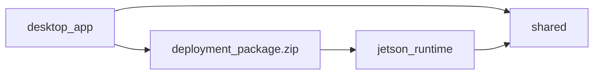

# Ground Region Tracker — Dual App Architecture

Two applications share a common core:

| App | Path | Role |
|-----|------|------|
| **Desktop Dataset & Deployment Manager** | `desktop_app/` | Annotate, build YOLO dataset, train, export ONNX, build Jetson package |
| **Jetson Orin Nano Runtime** | `jetson_runtime/` | Offline import package, detect/track target region under zoom |

Shared code lives in `shared/` (geometry, features, schemas, config, logging, video I/O, package validation).



---

## Install — Desktop (GPU PC)

```bash
cd /path/to/project
python3 -m venv .venv
source .venv/bin/activate
pip install -U pip
pip install torch torchvision --index-url https://download.pytorch.org/whl/cu124
pip install -r requirements-desktop.txt
python desktop_app/app.py
```

## Install — Jetson Orin Nano

Verified context: JetPack **R39.x**, TensorRT **10.x**, OpenCV **4.x**, Python **3.12**.

```bash
sudo nvpmodel -m 0
sudo jetson_clocks

cd /path/to/project
python3 -m venv .venv --system-site-packages
source .venv/bin/activate
pip install -U pip
pip install -r requirements-jetson.txt
# Optional YOLO runtime after JetPack-matched torch:
# pip install ultralytics onnx
```

---

## Desktop workflow

1. **New Project** — choose an empty folder (creates `project.json`, `annotations.db`, `videos/`, …).
2. **Add Video** — one or more reference videos (copied under `videos/` with relative paths).
3. **Annotate** — seek frames, draw Polygon/Rectangle ROI (image coordinates). Save multiple keyframes.
4. **Interpolate** — fill frames between keyframes (yellow); Confirm to promote.
5. **Build Dataset** — YOLO layout with **video-based** 70/20/10 split; default **segmentation**.
6. **Train YOLO** — non-blocking worker (`yolov8n-seg.pt` default, imgsz 640).
7. **Export ONNX** — `runs/model.onnx` or `tools/export_onnx.py`.
8. **Build Jetson Package** — ZIP with manifest, reference bank (AKAZE), checksums, runtime.yaml.

### Dataset layout

```text
datasets/dataset_v1/
├── images/{train,val,test}/
├── labels/{train,val,test}/
├── data.yaml
└── split_by_video.json
```

### Sample training CLI

```bash
yolo segment train data=datasets/dataset_v1/data.yaml model=yolov8n-seg.pt imgsz=640 epochs=100 batch=8 device=0
python tools/export_onnx.py --weights runs/train/weights/best.pt --output models/model.onnx
```

---

## Deployment package

```text
deployment_package/
├── manifest.json
├── model/{best.pt, model.onnx, model.engine?}
├── reference/{reference_image.jpg, roi_mask.png, descriptors.npz, templates/}
├── config/runtime.yaml
├── labels/classes.txt
├── checksums/sha256.json
└── README_DEPLOYMENT.md
```

### Sample `manifest.json`

```json
{
  "project_name": "field_plot_a",
  "target_class": "target_region",
  "model_type": "segmentation",
  "model_format": "onnx",
  "input_size": 640,
  "reference_roi": {"points": [[...]], "width": 1920, "height": 1080},
  "feature_method": "AKAZE",
  "min_confidence": 0.45,
  "min_iou": 0.20,
  "package_version": "1.0.0"
}
```

### Transfer

```bash
scp deployment_package.zip user@JETSON_IP:/home/user/packages/
```

On Jetson:

```bash
unzip deployment_package.zip -d deployment_package
# Prefer building engine on-device:
python tools/build_tensorrt.py --onnx deployment_package/model/model.onnx --output deployment_package/model/model.engine --fp16
python jetson_runtime/app.py --package deployment_package.zip --video /path/new.mp4 --headless
# or GUI:
python jetson_runtime/app.py
```

---

## Jetson Runtime algorithm

States: `INIT → SEARCHING → DETECTED → TRACKING ⇄ SCALE_CHANGE / RE_DETECTING → LOST → SEARCHING → COMPLETED`

- YOLO (+ reference AKAZE verification) for search / re-detect
- Homography + Optical Flow / CSRT between detections
- Multi-scale inference on `SCALE_CHANGE` / after `LOST`
- EMA/Kalman smoothing; adaptive frame skip when FPS drops
- Production path: TensorRT FP16; fallback ONNX → PyTorch (emergency)

Outputs: annotated video, CSV, JSON summary, lost frames.

---

## Zoom-friendly settings

- `yolo_every_n_frames`: 20–40  
- `feature_match_interval`: 3–5  
- `max_scale`: ≥ 8  
- `multi_scale_factors`: `[0.75, 1.0, 1.25]`  
- `imgsz`: 640 (drop to 480 if memory tight)

---

## Benchmark

```bash
python tools/benchmark.py --video data/input/sample.mp4 --roi 40,30,120,110 --mode manual
```

Or runtime headless stats (`avg_fps`, tracked/lost/redetect/scale_change) from `run_runtime`.

---

## Tests

```bash
pytest -q
```

---

## When is YOLO training required?

| Goal | Need YOLO? |
|------|------------|
| Track the same manually selected ROI in one video | No (features + trackers) |
| Find the **same physical plot** in new videos | YOLO + reference features (package) |
| Find **any similar region type** | YOLO on diverse dataset |

Train on desktop GPU (8–12 GB VRAM recommended). Build TensorRT **on the Jetson**.

---

## FAQ / limits

- Engines are JetPack/device specific — rebuild after upgrades.
- RTSP is stubbed for a future release (file video supported).
- Without a model, runtime initializes from package reference ROI and tracks via Homography/OF.
- GStreamer may fail on software-encoded MP4; OpenCV fallback is automatic.

## Entrypoints

```bash
python desktop_app/app.py
python jetson_runtime/app.py
python jetson_runtime/app.py --package pkg.zip --video new.mp4 --headless
python app.py desktop   # launcher
python app.py jetson
```
